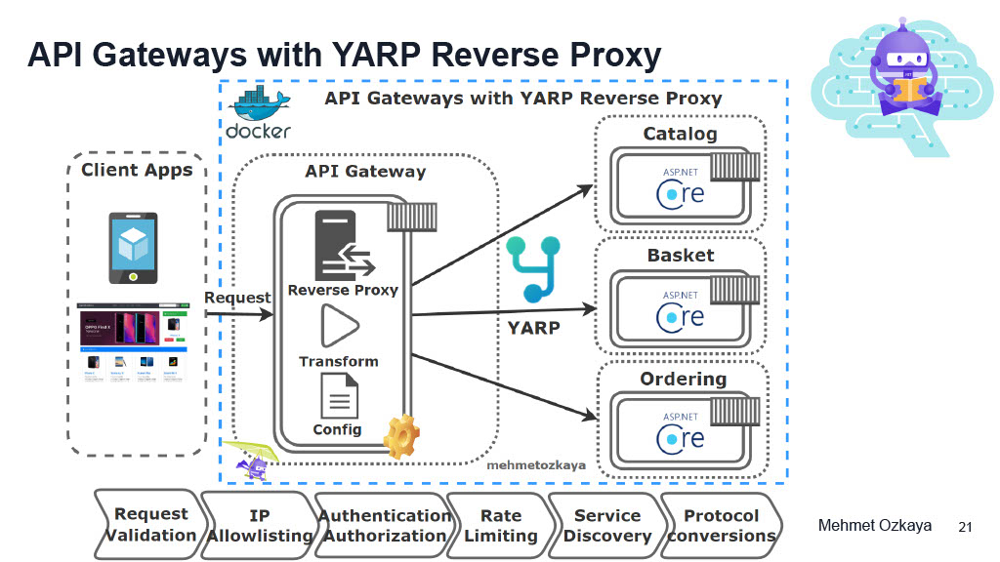

<details open>
<summary id="1-4"><strong>1-4</strong></summary>

### Summary
- **Branch Name**: `feature/01_introduction`
- **Course Summary**:
  - Course Introduction
  - What are Microservices, when to use it

<details open>
<summary><strong>Details</strong></summary>

- **Course Info**:
  - [Develop Microservices on .NET 8 used ASP.NET Web API, Docker, RabbitMQ, MassTransit, gRPC, Yarp Gateway, Redis,SqlServer](https://atp.udemy.com/course/microservices-architecture-and-implementation-on-dotnet/learn/lecture/42551424#overview)
  - Author: Mehmet Ozkaya

- **Source Code**:
  - [Coummunity's Repo](https://github.com/aspnetrun/run-aspnetcore-microservices)
  - [Author's Repo old .Net 5](https://github.com/mehmetozkaya/AspnetMicroservices)
  - [Author's Repo by section](https://github.com/mehmetozkaya/EShopMicroservices-Udemy-Sections)
  - [Author's Repo new .Net 8](https://github.com/mehmetozkaya/EShopMicroservices)
  - [My repo](https://github.com/VHTrung52/04_Basic_Microservice_1)
  - Code structure
    
  
- **Prequisites Software**:
  - Visual Studio / Rider
  - .Net 8
  - Docker Desktop
  - Postman

- **Project Architecture**:

 
 
 
 
 
 

 


- **Run The Final Application**:
  1. Clone the final project
  ```git clone https://github.com/mehmetozkaya/EShopMicroservices```
  2. Open project with Visual Studio / Rider and rebuild project (expect: buid success)
  3. set docker as startup project
      1. For `Visual Studio`: set `docker-compose` as startup project 
      2. For `Rider`: set run configuration to be `docker-compose.yml`
  4. Run project
      - Note for `Rider`: msg `pull access denied repository does not exist or may require docker login` appear when you run project is normal, just wait a few minutes.
  5. The result
      - Docker
      
      - Web application
      
      
      
      
      - RabbitMQ
      
</details>

<details>
<summary><strong>Bug</strong></summary>

  - **Bug 1**: Github stop using password.
    - Problem: 
      - Starting from August 13, 2021, GitHub has stopped accepting passwords for verifying Git operations on user accounts.
      - Push code using SourceTree return 403
    - Solution: 
      - Use personal access token instead of password for github
      - [how to create and add github personal access token to SourceTree](https://www.youtube.com/watch?v=y-1UU1gz0FU&ab_channel=NickGraham)
        - Note: other way to add it is via SourceTree -> Tools -> Options -> Authentication. This will return login failed or smth like that but actually it still work :v
        - 
  - **Bug 2**: Run project using Rider and docker-compose show `pull access denied repository does not exist or may require docker login`
    - Problem: 
      - using `Rider` and run project using docker-compose show msg `pull access denied repository does not exist or may require docker login`
      - 
    - Solution:
      - Just wait for Rider to pull the available container then it will build and pull the other. This error should not happen. You can try Visual Studio if there is any problem.
</details>
</details>

---