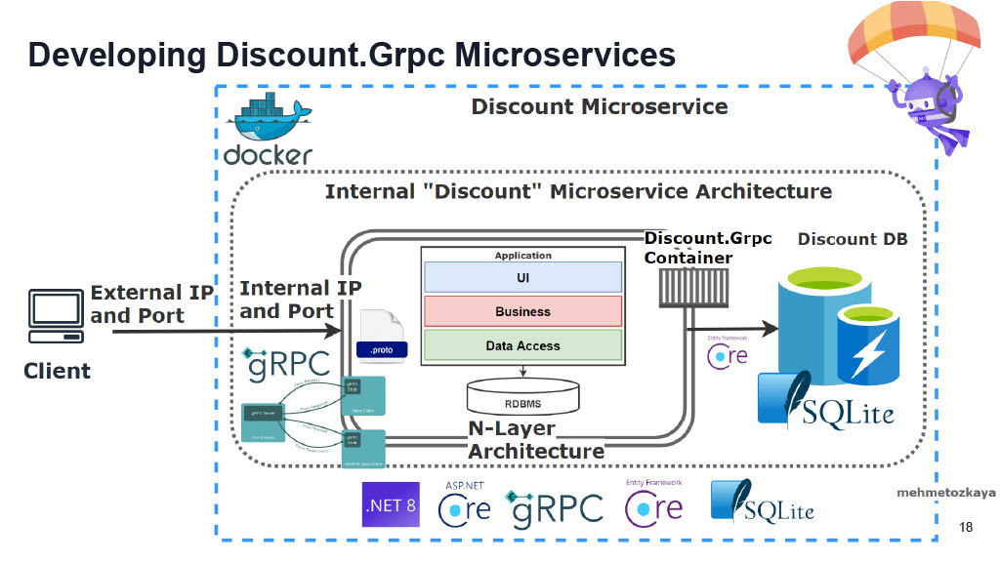
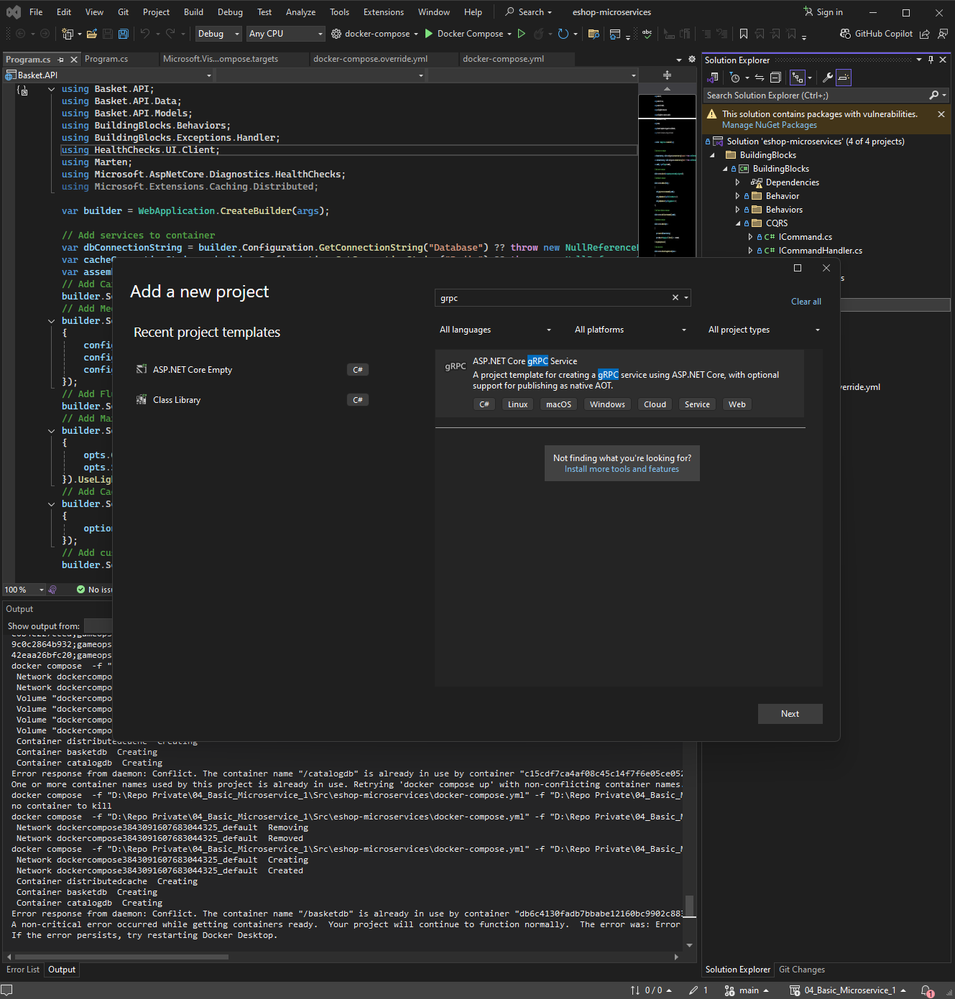
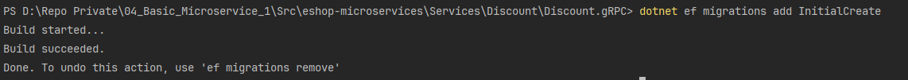

<strong>10-11</strong>

### Summary
- **Branch Name**: `feature/06_implement_discount_grpc`

<strong>Details</strong>

- **Architecture**:
 
- **Implementation**:
  - `Discount.gRPC` change
    - Create project
    - Install library
      - `Microsoft.EntityFrameworkCore.Sqlite` `9.0.0`
      - `Microsoft.EntityFrameworkCore.Tools` `9.0.0`
    - Add Sqlite database
    - Implement CRUD for discount
    - Add db migration and data migration
  - `Docker` change
    - Containerize `Discount.gRPC`

`cd` to project file `Discount.gRPC`

run command `dotnet ef migrations add InitialCreate` to create new migration

run command `dotnet ef database update` to update database

[Guild to run entity framework core command](https://blog.jetbrains.com/dotnet/2017/08/09/running-entity-framework-core-commands-rider/)

> I don't have any use for gRPC at the moment, i will delete gRPC module and replace it with REST api later

---

<strong>Bug</strong>

**Bug 1**: 

---