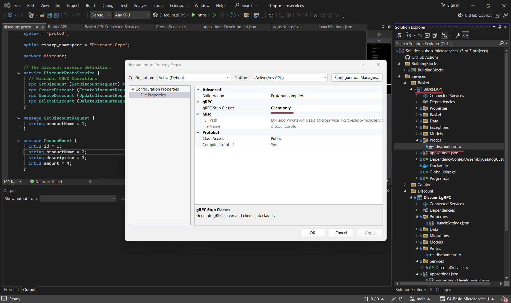

<strong>12</strong>

### Summary
- **Branch Name**: `feature/07_connect_discount_grpc_and_basket_api`

<strong>Details</strong>

- **Architecture**:

- **Implementation**:
    - `Basket.API`
        - Connect to `Discount.gRPC` to get discount data when store basket
    - `Docker`
        - Update `Basket.API` to connect to `Discount.gRPC`

- Connect `Discount.gRPC` to `Basket.API`
    - 
    
    
    
    
    
    
    
    

---