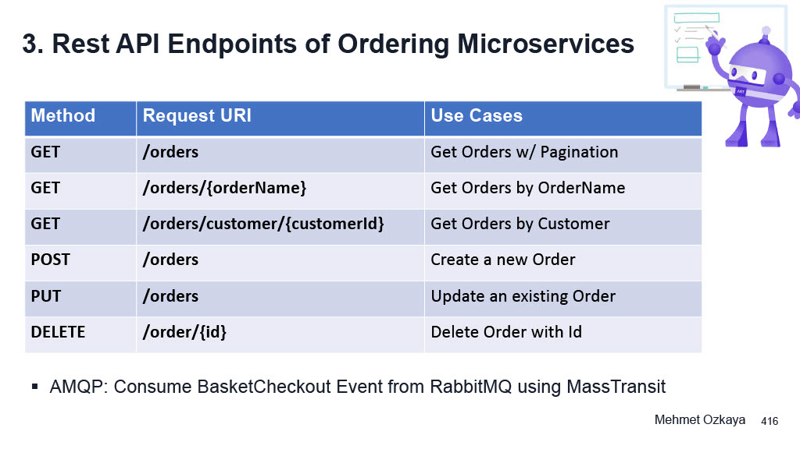
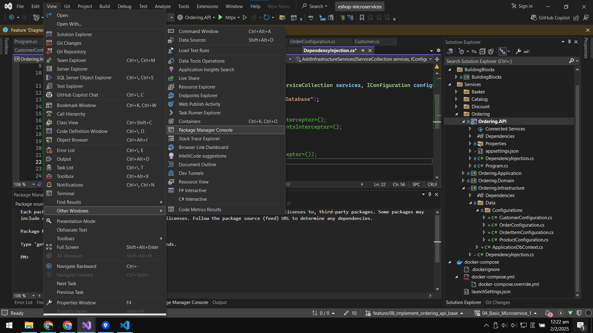
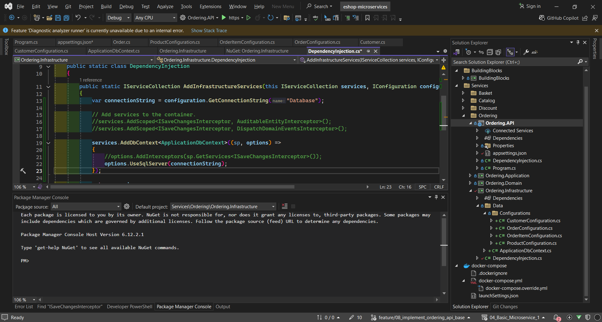
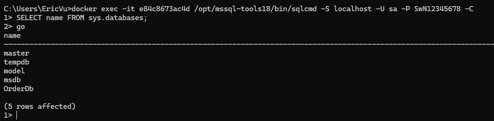

<strong>13</strong>

---
- **Branch Name**: `feature/07_connect_discount_grpc_and_basket_api`
---
- **Architecture**:

---
- **Implementation**:
    - Create project Ordering
    - Implement DDD pattern
    - Add migration
    
    
        - `Add-Migration InitialCreate -OutputDir Data/Migrations -Project Ordering.Infrastructure -StartupProject Ordering.API`
        - other `dotnet ef migrations add InitialCreate -o Data/Migrations -p Ordering.Infrastructure -s Ordering.API`
    - install library
        - `<PackageReference Include="Microsoft.EntityFrameworkCore" Version="9.0.1">`
        - `<PackageReference Include="Microsoft.EntityFrameworkCore.SqlServer" Version="9.0.1">`
        - `<PackageReference Include="Microsoft.EntityFrameworkCore.Tools" Version="9.0.1">`
        - `<PackageReference Include="Microsoft.EntityFrameworkCore.Design" Version="9.0.1">`
    - dependency between each project
    - which library for which project
    - add migration
    - add seed data
    - add order db to docker
    - crud for ordering using cqrs
    - seperate dependency injection for each project 
    - add global exception handler
    - implement minimal api using carter
    - add interceptor
    - tbu
---
- **Other**:
    - `Docker` command to open bash shell to sql server container and execute query
        - in cmd
        - `docker ps`
        - docker log <container-name/container-id>
        - docker exec -it <container-name/container-id> sh
        - docker exec -it <container-name/container-id> /opt/mssql-tools18/bin/sqlcmd -S localhost -U <username> -P <password> -C -Q "<query>
            - Ex: docker exec -it e84c8673ac4d /opt/mssql-tools18/bin/sqlcmd -S localhost -U sa -P SwN12345678 -C -Q "SELECT @@VERSION"
            - docker exec -it e84c8673ac4d /opt/mssql-tools18/bin/sqlcmd -S localhost -U sa -P SwN12345678 -C -d orderDb -Q "SELECT * FROM customers;" -W
            - docker exec -it e84c8673ac4d /opt/mssql-tools18/bin/sqlcmd -S localhost -U sa -P SwN12345678 -C
        - ko cần thêm port number theo mình hiểu khi sử dụng docker exec <container-name/container-id> là đang chạy lệnh đó trong container rồi -> sql ở đó chạy cổng mặc định
        - 
        - chạy lệnh trong sqlcmd phải có lệnh `Go` thì sql mới execute các lệnh phía trên và trả về kết quả 

        - in docker desktop -> exec 
        - /opt/mssql-tools18/bin/sqlcmd -S localhost -U <username> -P <password> -C -Q "<query> -W
        - /opt/mssql-tools18/bin/sqlcmd -S localhost -U <username> -P <password> -C -d <database> -W
            - Ex: /opt/mssql-tools18/bin/sqlcmd -S localhost -U sa -P SwN12345678 -C -d orderDb -Q "SELECT * FROM customers;" -W
    - `SQL` command 
        - SELECT name FROM sys.databases;
        - SELECT TABLE_NAME FROM INFORMATION_SCHEMA.TABLES WHERE TABLE_TYPE = 'BASE TABLE';
        - SELECT @@VERSION
        - use <database-name>
    - `Git` command to switch branch
        - git fetch
        - git branch -v -a
        - git switch <branch-name>
 ---       
- **Bug** 
    - `Login timeout expired. TCP Provider: Error code 0x2749` properly you are using the wrong port, try remove port 
    - `/bin/sh: 22: sqlcmd: not found` [solution](https://stackoverflow.com/questions/61872171/why-sqlcmd-not-found-during-docker-compose-up-build) -> change the path to sqlcmd

