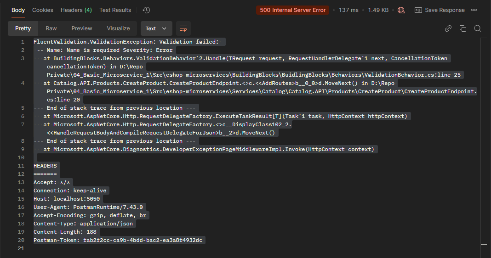
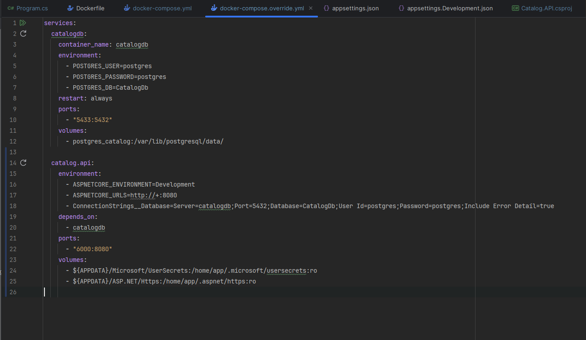
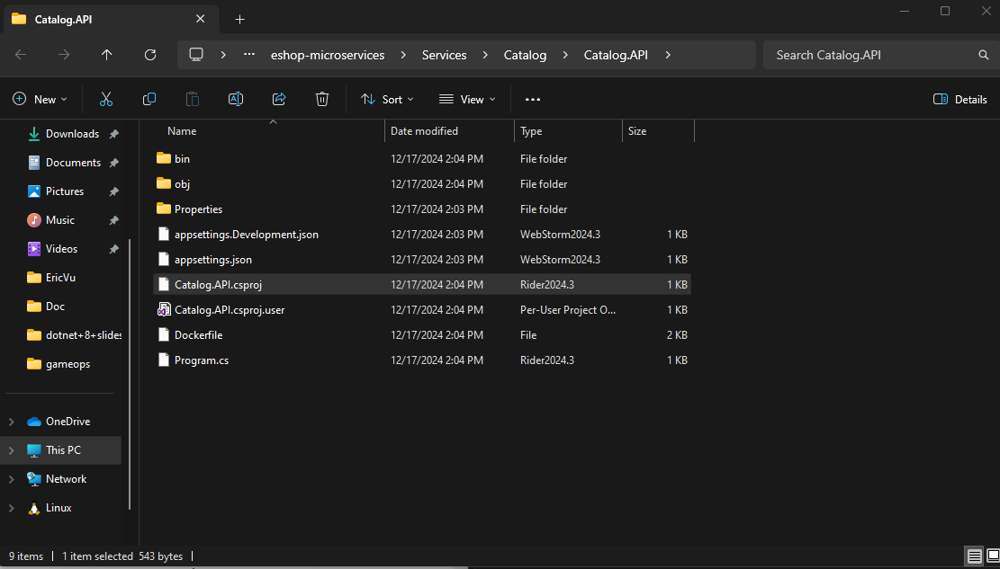
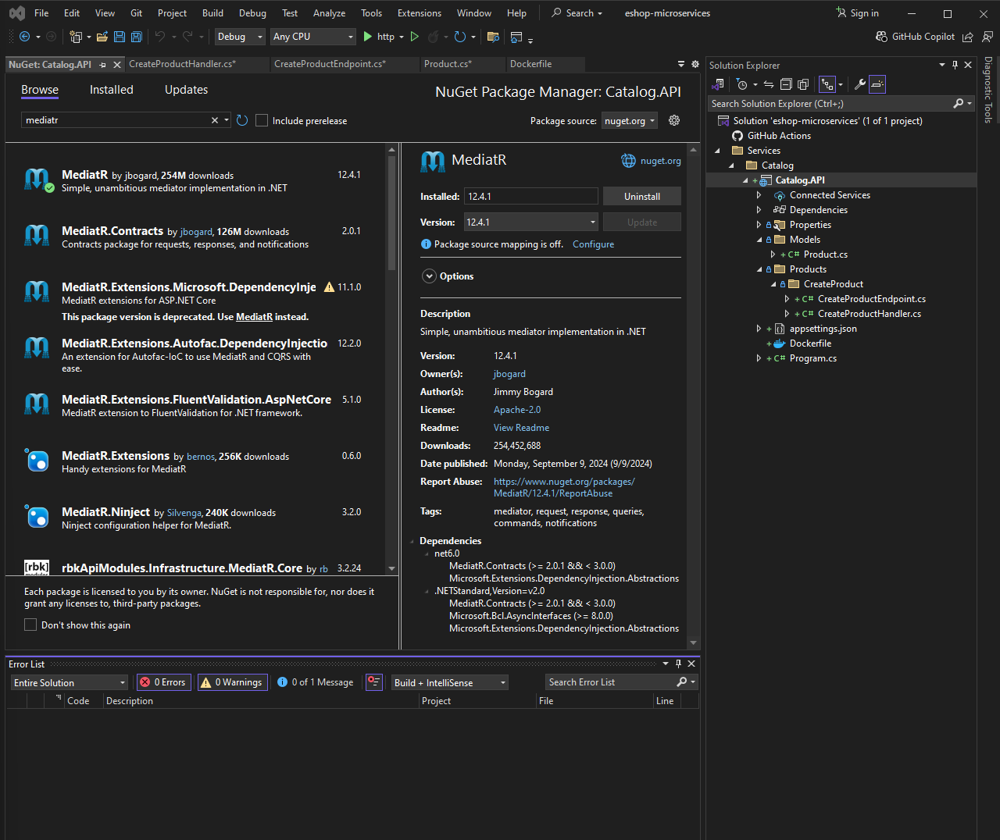
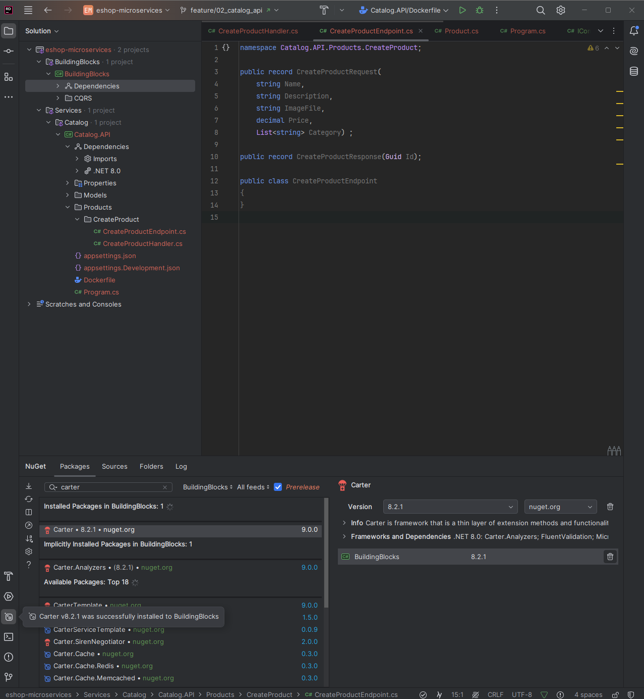
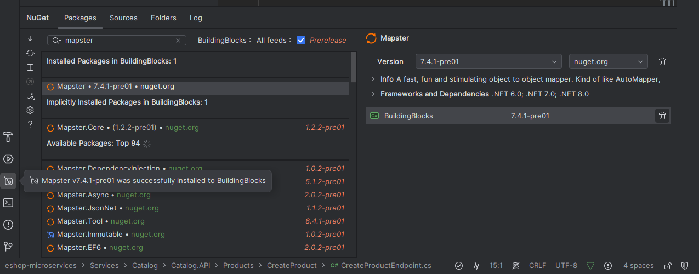

<details open>
<summary id="5-???"><strong>5-???</strong></summary>

### Summary
- **Branch Name**: `feature/5-???`
- **Course Summary**:

<details open>
<summary><strong>Details</strong></summary>

- **Architecture**:

- **Implementation**:
    - Create a github repo and add add `.gitignore` file, clone the project to local
    - Create a new solution 
    
    
    add Services\Catalog to path
    
    enable container/docker support
    result
    
    

    install mediatr package 

    - Create building block (class library)
    - install mediatr packeage for buidling 
    block
        

    - in project Catalog.API add reference to project BuildingBlock
    - install carter package for buidling block
    
    - install mapster package for buidling block
    
- **Bug**:
    - Carter modules are not registered in ASP.NET Core app
        - Problem: 
            - Using `Carter 8.2.1` does not directly support If you use layered architecture and If you added the Carter to service layer , not to WebAPI layer
        - Solution:
            - [Github link](https://stackoverflow.com/questions/77180710/carter-modules-are-not-registered-in-asp-net-core-app/79015329#79015329)
            - Solution 1:
                - Create own `DependencyContextAssemblyCatalog` class like as below:
```csharp
    public class DependencyContextAssemblyCatalogCustom : DependencyContextAssemblyCatalog
    {
        public override IReadOnlyCollection<Assembly> GetAssemblies()
        {
            return new List<Assembly> { typeof(Program).Assembly };
        }
    }
```
Register the `Carter` like as below in `Program.cs`

```csharp
builder.Services.AddCarter(new DependencyContextAssemblyCatalogCustom());
```

Solution 2:

You only need to add the Carter library to the entry assembly (for example Web API project) 

Register the `Carter` like as below in `Program.cs`

```csharp
builder.Services.AddCarter();
```
- Class cannot have a primary constructor
        - Problem
            - Visual studio show error `Class cannot have a primary constructor` but still build success
        - Solution
            - [Github Solution](https://stackoverflow.com/questions/77487192/primary-constructor-feature-c12-doesnt-compile)
            - Due to out date `ReSharper` causing the error, update `ReSharper` then restart `Visual Studio` and the error will be reslove


</details>
</details>

---