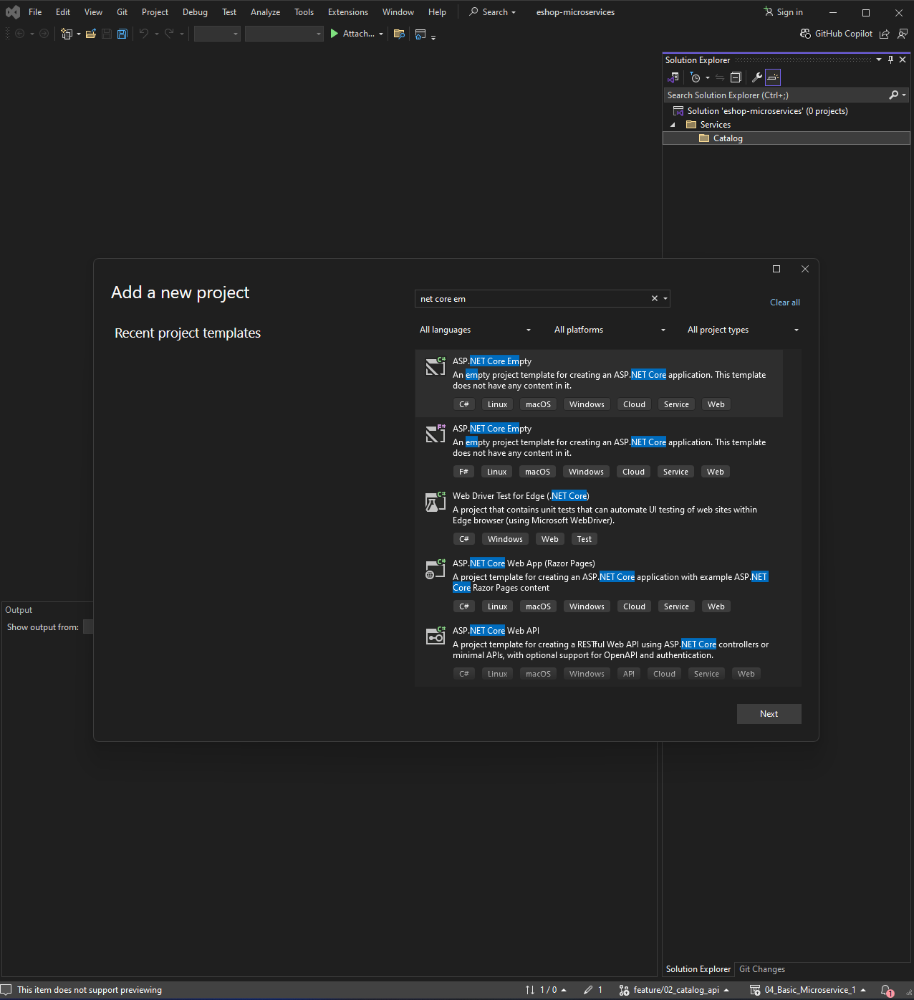
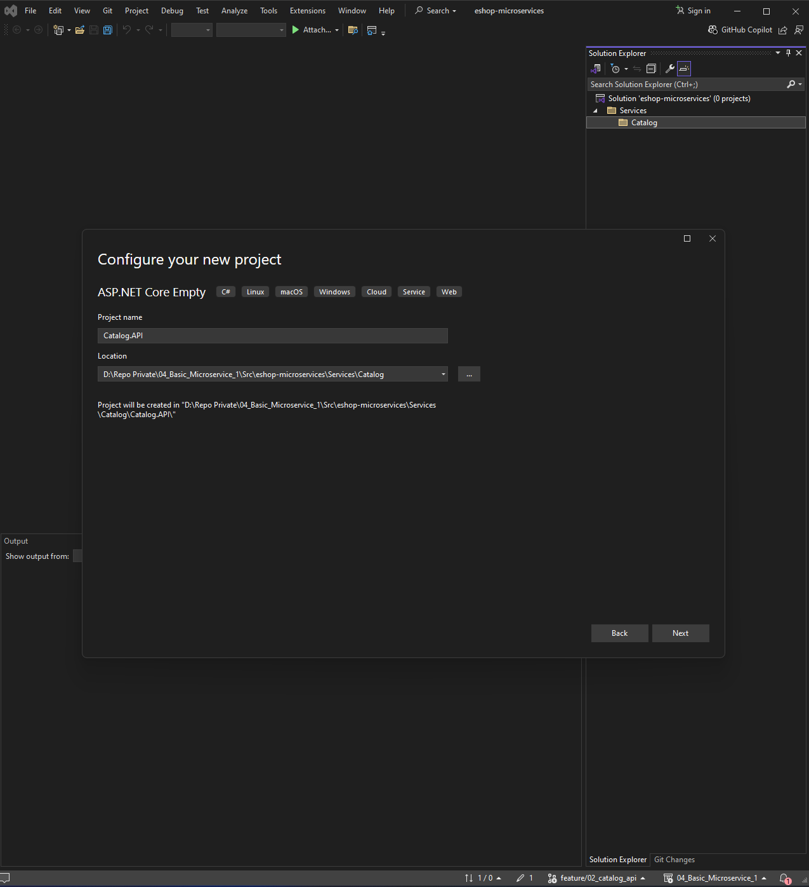
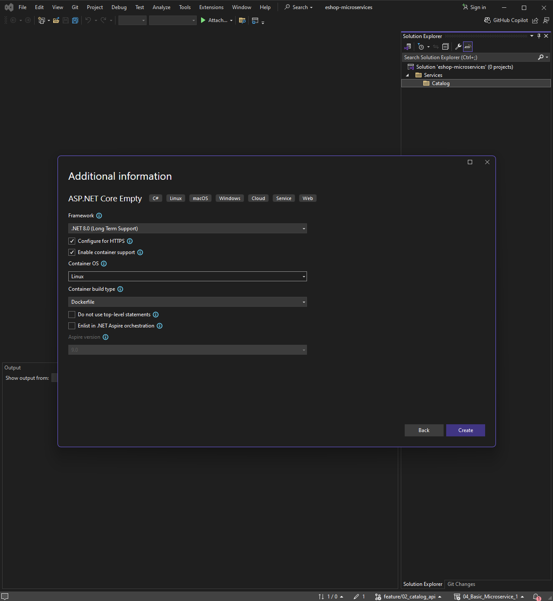
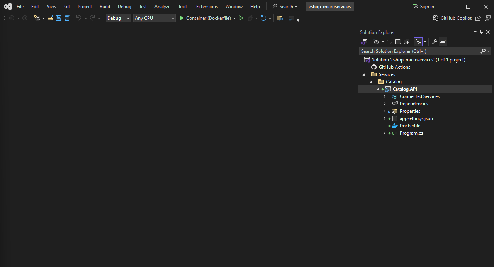
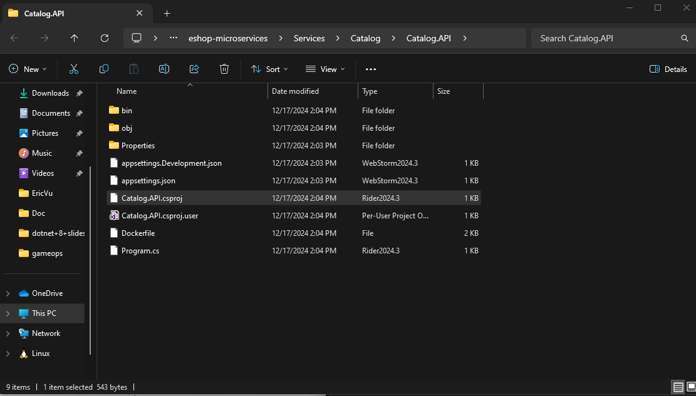
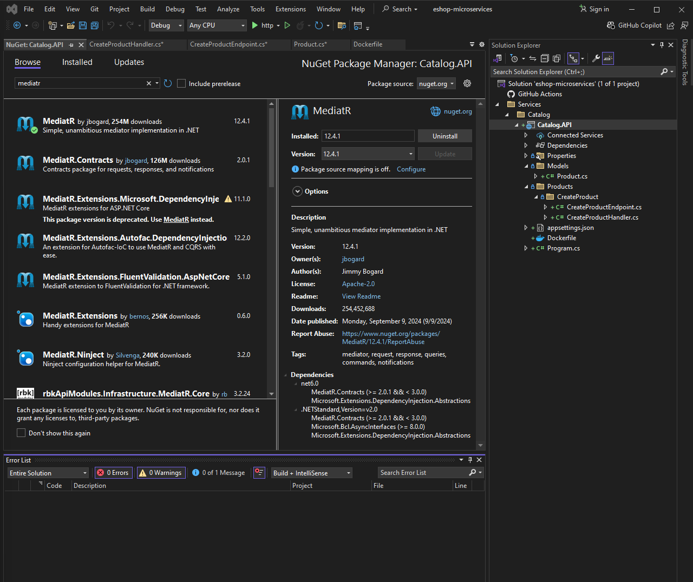
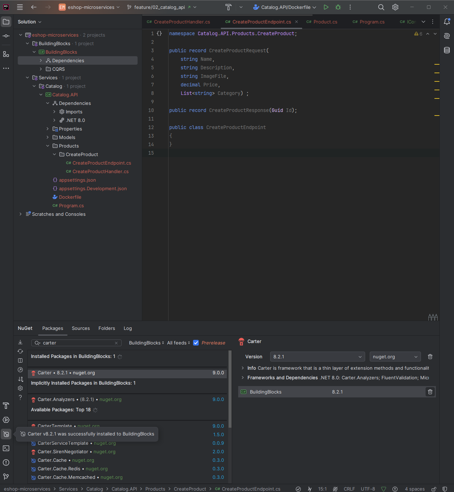
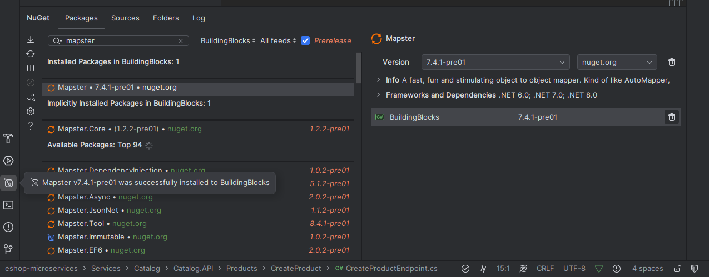

<details open>
<summary id="5-6"><strong>5-6</strong></summary>

- **Branch Name**: `feature/02_implement_catalog_api_base`
- **Course Summary**:
    - Implement `BuildingBlock` for common library of the project with `MediatR`,`Carter`,`Mapster`
    - Implement `CatalogAPI` CRUD with `Marten`, `Docker`, `PostgreSQL`

<details>
<summary><strong>Details</strong></summary>

- **Architecture**:

- **Implementation**:
    - Create project repo 
    - Implement `BuildingBlock` and `CatalogAPI`
        - `BuildingBlock`, project for common library that used in the solution
        - `CatalogAPI`, place for Catalog logic
    - `BuildingBlock` change
        - Install common library
            - `MediatR`
            - `Carter`
            - `Mapster`
    - `CatalogAPI` change
        - Implement `Global using` to simplify import 
        - Register/Implement common library
            - `MediatR`
            - `Carter`
            - `Mapster`
        - Implement exclusive library
            - `Marten`
        - Implement `Minimal API endpoint` using `Carter` library 
        - Implement basic api
            - get products
            - create product
            - get product by id
            - get product by category
            - update product
            - delete product
    - `Docker` change
        - Containerized CatalogDb
        - Add `Docker-Compose`

    - Create a github repo and add add `.gitignore` file, clone the project to local
    - Create a new solution 
    
    
    add Services\Catalog to path
    
    enable container/docker support
    result
    
    

    install mediatr package 

    - Create building block (class library)
    - install mediatr package for buidlingblock
        

    - in project Catalog.API add reference to project BuildingBlock
    - install carter package for buidling block
    
    - install mapster package for buidling block
    

    - add docker container support for postgres db only for developing purpose, when finish development i will containerize both catalogAPI and postgres db
    - this step should use Visual Studio because at the time of writing this
        - it seem like Visual Studio have more support when it come to generating docker file 
        - i don't familiar with docker file enough
        - to follow with the author of the course

    - Check CatalogDb in Docker container
    
    
    `\q` for exit  PostgreSQL command line utility `psql`
    

    testing 
    
     ```select * from mt_doc_product;```
     


</details>
   
<details>
<summary><strong>Bug</strong></summary>

- **Bug 1**: Carter modules are not registered in ASP.NET Core app
    - Problem: 
        - Using `Carter 8.2.1` does not directly support If you use layered architecture and If you added the Carter to service layer , not to WebAPI layer
    - Solution:
        - [Github link](https://stackoverflow.com/questions/77180710/carter-modules-are-not-registered-in-asp-net-core-app/79015329#79015329)
        - Solution 1:
            - Create own `DependencyContextAssemblyCatalog` class like as below:
```csharp
    public class DependencyContextAssemblyCatalogCustom : DependencyContextAssemblyCatalog
    {
        public override IReadOnlyCollection<Assembly> GetAssemblies()
        {
            return new List<Assembly> { typeof(Program).Assembly };
        }
    }
```

- Register the `Carter` like as below in `Program.cs`

```csharp
builder.Services.AddCarter(new DependencyContextAssemblyCatalogCustom());
```

Solution 2:

You only need to add the Carter library to the entry assembly (for example Web API project) 

Register the `Carter` like as below in `Program.cs`

```csharp
builder.Services.AddCarter();
```
- **Bug 2**: Class cannot have a primary constructor
    - Problem
        - Visual studio show error `Class cannot have a primary constructor` but still build success
    - Solution
        - [Github Solution](https://stackoverflow.com/questions/77487192/primary-constructor-feature-c12-doesnt-compile)
        - Due to out date `ReSharper` causing the error, update `ReSharper` then restart `Visual Studio` and the error will be reslove

</details>

</details>

---