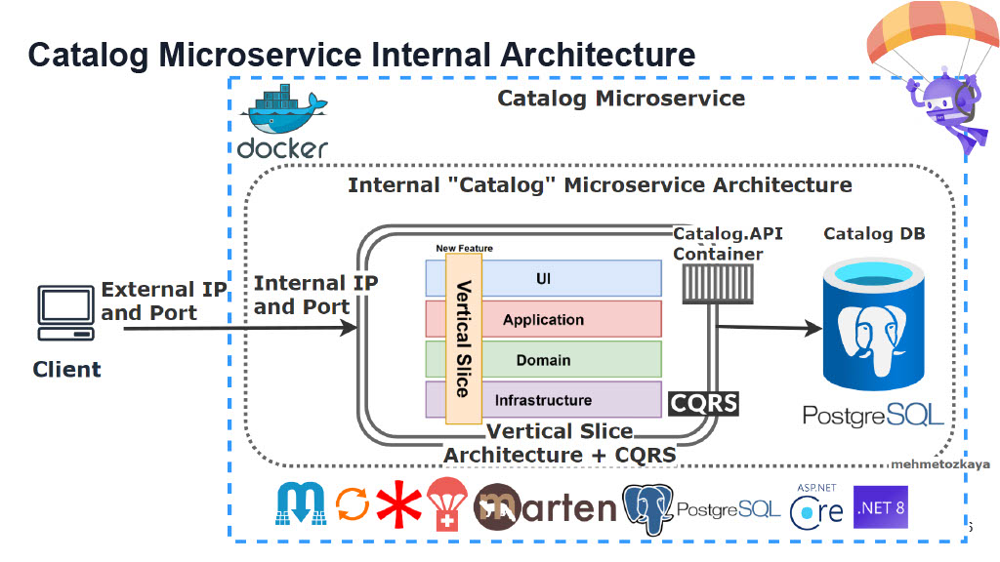
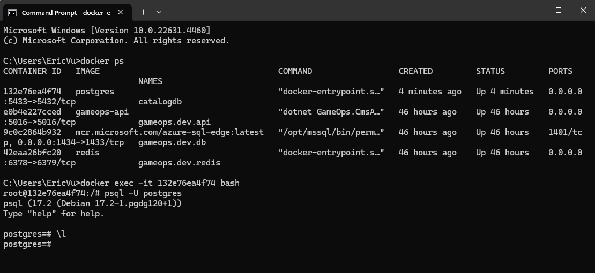
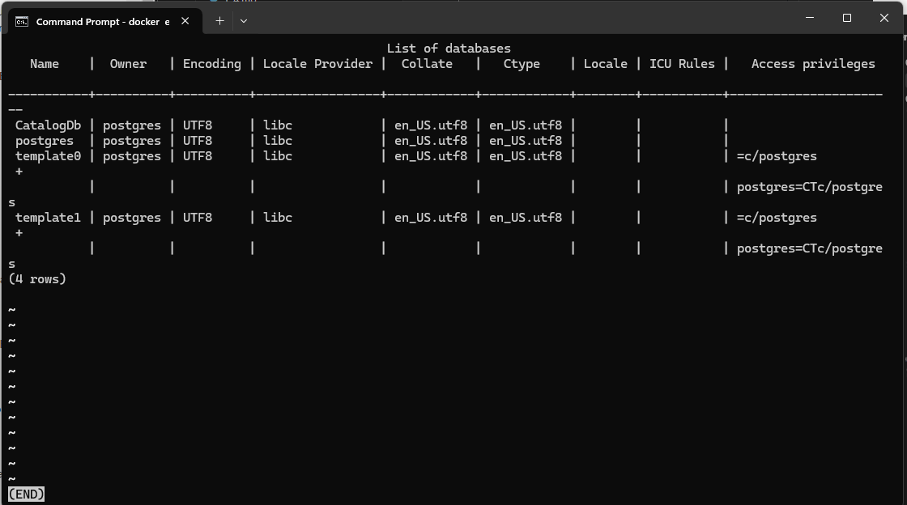
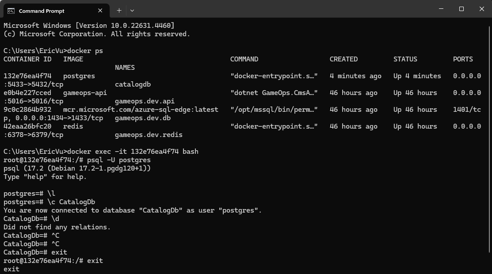
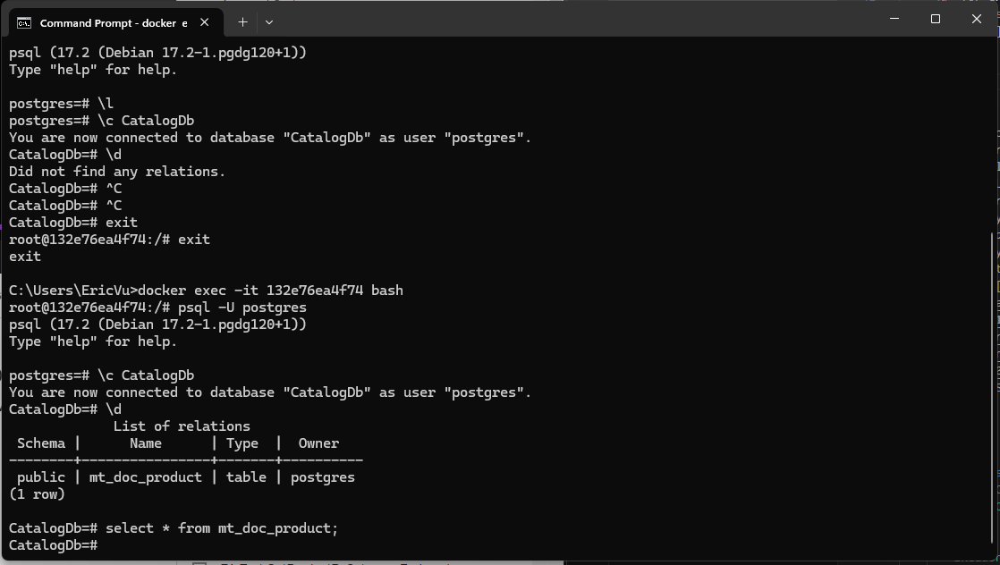
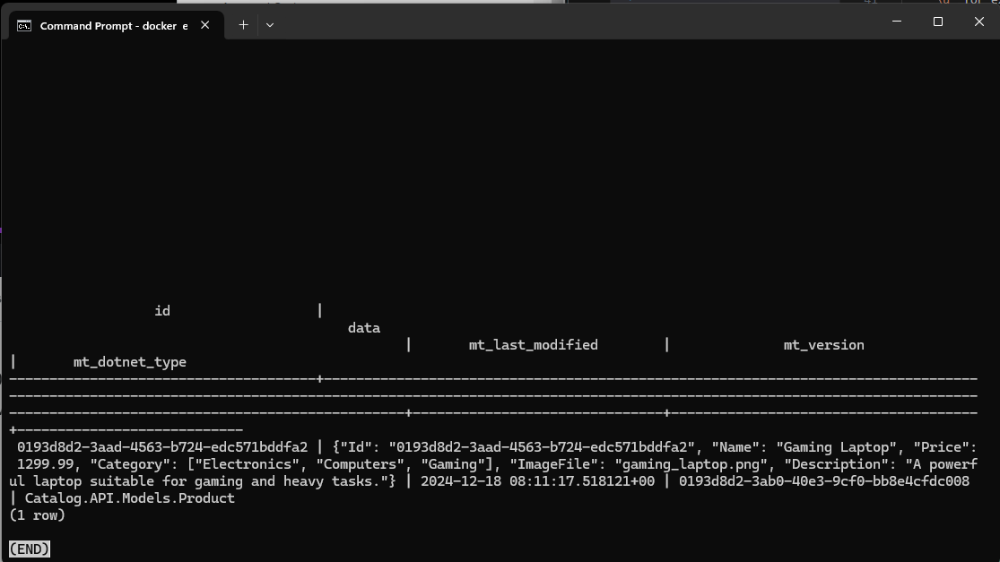

<details open>
<summary id="5-6"><strong>5-6</strong></summary>

- **Branch Name**: `feature/02_implement_catalog_api_base`

<details>
<summary><strong>Details</strong></summary>

- **Architecture**:

- **Implementation**:
    - Create project repo and add  `.gitignore` file
    - Implement `BuildingBlock` and `CatalogAPI`
        > [!NOTE]
        > When create project, you need to create actual folder, folder in `Visual Studio` is logic folder and not actually being created in File Explorer, you have to go to `File Explorer` and in your project folder create the folder you want or specific it in the path when create new project
        - `BuildingBlock`, project for common library that used in the solution
        - `CatalogAPI`, place for Catalog logic
    - `BuildingBlock` change
        - Install common library
            - `MediatR` ver `12.4.1`
            - `Carter` ver `8.2.1`
            - `Mapster` ver `7.4.1`
    - `CatalogAPI` change
        - Add reference to project `BuildingBlock`
        - Implement `Global using` to simplify import 
        - Register/Implement common library
            - `MediatR`
            - `Carter`
            - `Mapster`
        - Implement exclusive library
            - `Marten` ver `7.34.1`
        - Implement `Minimal API endpoint` using `Carter` library 
        - Implement basic api
            - get products
            - create product
            - get product by id
            - get product by category
            - update product
            - delete product
    - `Docker` change
        - Containerized CatalogDb (PostgreSQL)
        - Add `Docker-Compose`
    
    - Add `Docker Compose` this step should use `Visual Studio` because at the time of writing this
        - it seem like Visual Studio have more support when it come to generating docker file 
        - i don't familiar with docker file enough
        - to follow with the author of the course

    - How to check CatalogDb in Docker container
        - In `cmd`
            - Run ```docker ps``` to shows running containers
            - Run ```docker exec -it {container_id} bash``` to open bash shell of your container
            - Run ```psql -U {username} to open PostgreSQL terminial
        - In `PostgreSQL terminial`
            - Run `\l` to list all database
            - Run `\q` for exit  PostgreSQL command line utility `psql`
            - Run `\c {database_name}` to connect to  specific database (when connected you can execute sql command)
            - Run `\d` to list database objects

    - Connect to database
    
    
    
    - Check data in database after create
    
     ```select * from mt_doc_product;```
     


</details>
   
<details>
<summary><strong>Bug</strong></summary>

- **Bug 1**: Carter modules are not registered in ASP.NET Core app
    - Problem: 
        - Using `Carter 8.2.1` does not directly support If you use layered architecture and If you added the Carter to service layer , not to WebAPI layer
    - Solution:
        - [Github link](https://stackoverflow.com/questions/77180710/carter-modules-are-not-registered-in-asp-net-core-app/79015329#79015329)
        - Solution 1:
            - Create own `DependencyContextAssemblyCatalog` class like as below:
```csharp
    public class DependencyContextAssemblyCatalogCustom : DependencyContextAssemblyCatalog
    {
        public override IReadOnlyCollection<Assembly> GetAssemblies()
        {
            return new List<Assembly> { typeof(Program).Assembly };
        }
    }
```

- Register the `Carter` like as below in `Program.cs`

```csharp
builder.Services.AddCarter(new DependencyContextAssemblyCatalogCustom());
```

Solution 2:

You only need to add the Carter library to the entry assembly (for example Web API project) 

Register the `Carter` like as below in `Program.cs`

```csharp
builder.Services.AddCarter();
```
- **Bug 2**: Class cannot have a primary constructor
    - Problem
        - Visual studio show error `Class cannot have a primary constructor` but still build success
    - Solution
        - [Github Solution](https://stackoverflow.com/questions/77487192/primary-constructor-feature-c12-doesnt-compile)
        - Due to out date `ReSharper` causing the error, update `ReSharper` then restart `Visual Studio` and the error will be reslove

</details>

</details>

---