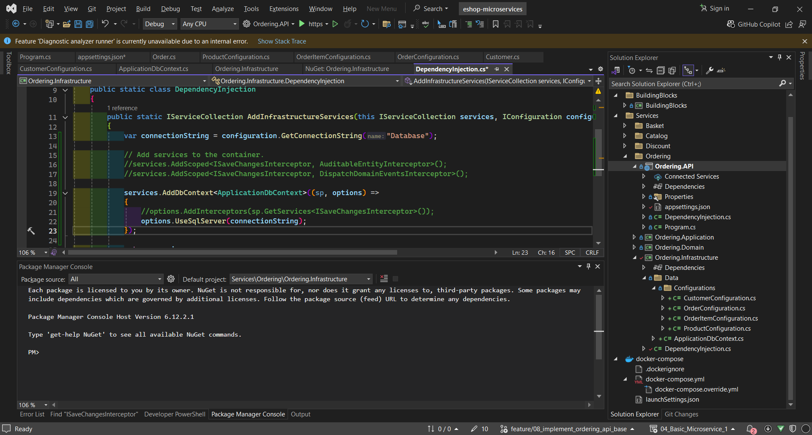
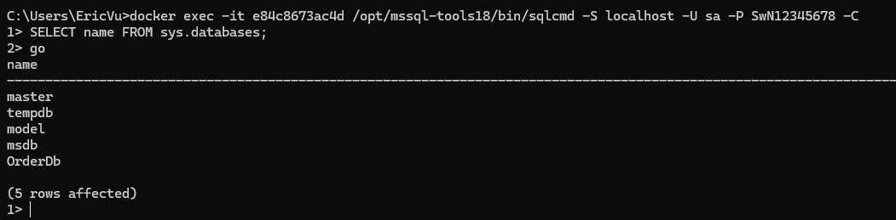

<strong>7-???</strong>

- **Branch Name**: `feature/03_`

<strong>Details</strong>

- **Architecture**:

- **Implementation**:
    - `BuildingBlock` change
        - Install common library
            - `FluentValidation.DependencyInjectionExtensions` ver `11.11.0`
    - `CatalogAPI` change
        - Implement common library 
            - `FluentValidation.DependencyInjectionExtensions` ver `11.11.0`
                - the author implement validation at command/query level but i think best practise is to implement it at controller/endpoint/request level
                - other way to implement fluentvalidation (not recommend)
                
                

    - `Docker` change
       

   

<strong>Bug</strong>

---