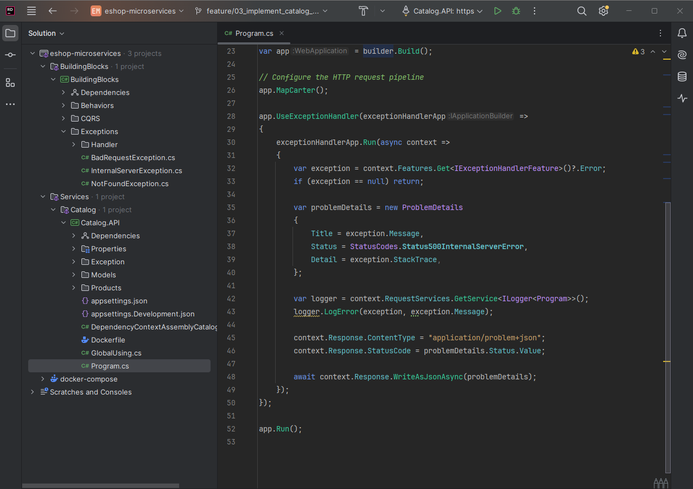
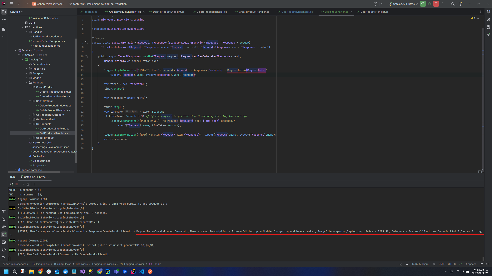

<details open>
<summary id="7"><strong>7</strong></summary>

- **Branch Name**: `feature/03_implement_catalog_api_validation`

<details open>
<summary><strong>Details</strong></summary>

- **Architecture**:

- **Implementation**:
    - `BuildingBlock` change
        - Install common library
            - `FluentValidation.DependencyInjectionExtensions` `11.11.0`
            - `FluentValidation` `11.11.0`
        - Implement `ValidationBehavior` for validate all validator class and return errors if any
        - Implement `CustomExceptionHandler` for global exception handling
        - Implement `LoggingBehavior` for common logging 
    - `CatalogAPI` change
        - Register/Implement common library
            - `FluentValidation.DependencyInjectionExtensions`
            - `FluentValidation`
        - Implement `Seeding Data`
        - Implement paging for api `GetProducts`
        - Install library
            - `AspNetCore.HealthChecks.NpgSql` `8.0.2` allow health check for postgreSQL Db
            - `AspNetCore.HealthChecks.UI.Client` `8.0.1` allow returning health check result as Json
        - Implement health check for CatalogAPI and postgreSQL db
    - `Docker` change
        - Containerize `CatalogAPI` together with existing `CatalogDb`

- Other way to implement exception handler
    ``` CSharp
    app.UseExceptionHandler(exceptionHandlerApp =>
    {
        exceptionHandlerApp.Run(async context =>
        {
            var exception = context.Features.Get<IExceptionHandlerFeature>()?.Error;
            if (exception == null) return;

            var problemDetails = new ProblemDetails
            {
                Title = exception.Message,
                Status = StatusCodes.Status500InternalServerError,
                Detail = exception.StackTrace,
            };

            var logger = context.RequestServices.GetService<ILogger<Program>>();
            logger.LogError(exception, exception.Message);

            context.Response.ContentType = "application/problem+json";
            context.Response.StatusCode = problemDetails.Status.Value;

            await context.Response.WriteAsJsonAsync(problemDetails);
        });
    });
    ```
    

- Other way to implement `Fluent Validation` (not recommend)
    
    


---
</details>
   
<details open>
<summary><strong>Bug</strong></summary>

**Bug 1**: `LoggingBehavior` does not serialize object so when read the log some data is missing


**Bug 2**: `System.InvalidOperationException: Unable to configure HTTPS endpoint. No server certificate was specified, and the default developer certificate could not be found or is out of date.` when run .net project with docker
- Solution: i can't config for `https` but this can fix for `http`. This bug is cause by breaking change of `.Net 8`

[StackOverFlow Solution](https://stackoverflow.com/questions/59743735/docker-image-unable-to-configure-https-endpoint-no-server-certificate-was-spec)

add `- ASPNETCORE_URLS=http://+:8080` to your `docker-compose.override.yml` file and remove port config for `https` like `- ASPNETCORE_HTTPS_PORTS=8081` and `- "6060:8081"`

``` docker
  catalog.api:
    environment:
      - ASPNETCORE_ENVIRONMENT=Development
      - ASPNETCORE_URLS=http://+:8080
      - ConnectionStrings__Database=Server=catalogdb;Port=5432;Database=CatalogDb;User Id=postgres;Password=postgres;Include Error Detail=true
    depends_on:
      - catalogdb
    ports:
      - "6000:8080"
    volumes:
      - ${APPDATA}/Microsoft/UserSecrets:/home/app/.microsoft/usersecrets:ro
      - ${APPDATA}/ASP.NET/Https:/home/app/.aspnet/https:ro
```


---
</details>

</details>

---