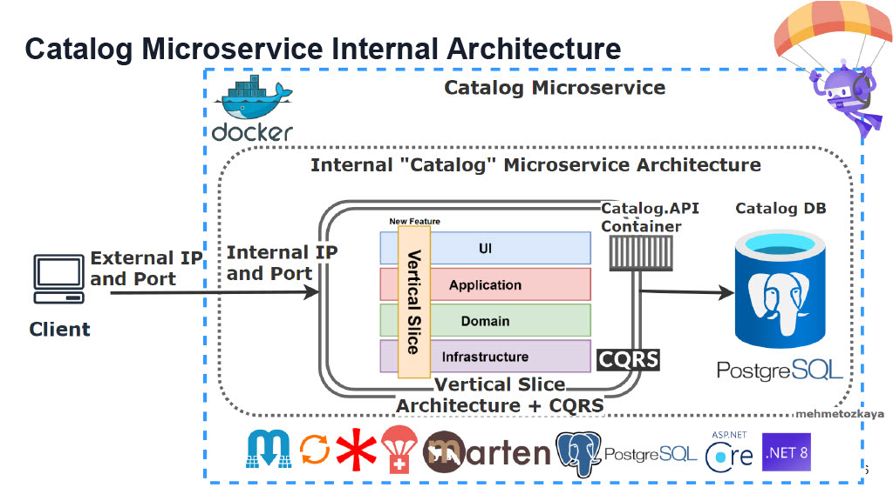

<strong>7-</strong>

- **Branch Name**: `feature/03`

<strong>Details</strong>

- **Architecture**:

- **Implementation**:
    - `BuildingBlock` change
        - Install common library
            - `FluentValidation.DependencyInjectionExtensions` `11.11.0`
            - `FluentValidation` `11.11.0`
        - Implement `ValidationBehavior` for validate all validator class and return errors if any
    - `CatalogAPI` change
        - Register/Implement common library
            - `FluentValidation.DependencyInjectionExtensions`
            - `FluentValidation`

   

<strong>Bug</strong>

---