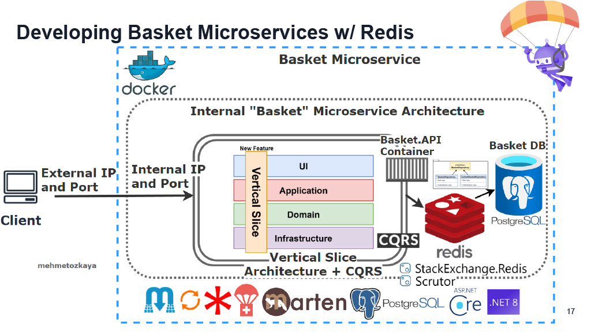

<strong>9</strong>

### Summary
- **Branch Name**: `feature/05_implement_basket_api_cache`

<strong>Details</strong>

- **Architecture**:

 

- **Implementation**:
    - `BasketAPI` change
        - Implement `Proxy Pattern`, `Decorator Pattern`
        - Install library
            - `Microsoft.Extensions.Caching.StackExchangeRedis` `9.0.0`
            - `Scrutor` `5.1.0`
            - `AspNetCore.HealthChecks.Redis` `9.0.0`
            - `AspNetCore.HealthChecks.NpgSql` `9.0.0`
            - `AspNetCore.HealthChecks.UI.Client` `8.0.1` allow returning health check result as Json
        - Add `Health Check` for  `BasketAPI`, `BasketDb`, `DistributedCache`
    - `Docker` change
        - Containerized `DistributedCache` (redis)
        - Containerized `BasketAPI` 

    - 2 way to register decorator

    - Containerized redis 
        - `redis-cli` to access redis terminal
        - `set {key} {value}` create new key value
        - `ping` to test redis is working
    
---

<strong>Bug</strong>

---