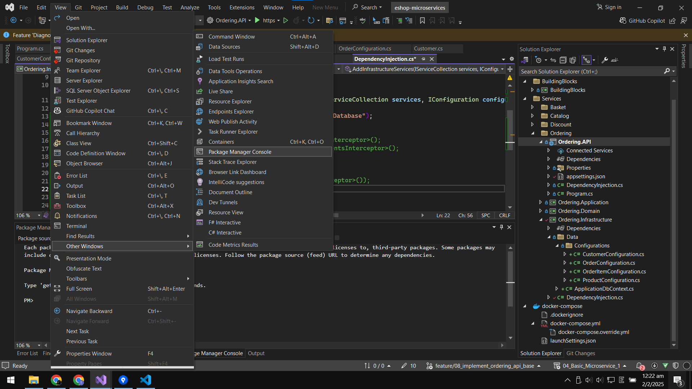

<strong>9</strong>

### Summary
- **Branch Name**: `feature/05_implement_basket_api_cache`

<strong>Details</strong>

- **Architecture**:

- **Implementation**:
    - `BasketAPI` change
        - Implement `Proxy Pattern`, `Decorator Pattern`
        - Install library
            - `Microsoft.Extensions.Caching.StackExchangeRedis` `9.0.0`
            - `Scrutor` `5.1.0`
    - `Docker` change
        - Containerized BasketDb (PostgreSQL)

    - 2 way to register decorator

---

<strong>Bug</strong>

---